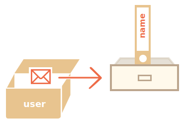
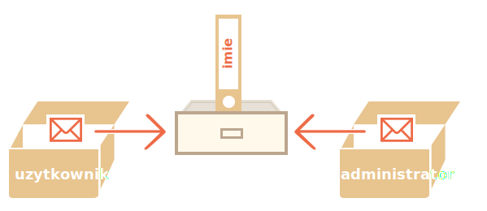

# Referencje do obiektów i kopiowanie

Jedną z fundamentalnych różnic między typami obiektowymi a prymitywnymi jest to, że obiekty są przechowywane oraz
kopiowane "przez referencję", gdzie prymitywne wartości: łańcuchy znaków, liczby, typ boolowski, itd -- zawsze są
kopiowane "jako cała wartość".

Łatwo to zrozumieć, jeśli spojrzymy pod maską co dokładnie się dzieje, kiedy kopiujemy przez wartość.

Zacznijmy od typu prymitywnego, takiego jak łańcuch znaków.

Poniżej kopiujemy wartość zmiennej `message` do `phrase`:

```js
let message = "Cześć!";
let phrase = message;
```

W rezultacie otrzymujemy dwie niezależne zmienne, przechowujące łańcuch znaków `"Cześć!"`.


Jest to całkiem oczywisty rezultat, prawda?

Z obiektami jest trochę inaczej.

**Zmienna przypisana do obiektu nie przechowuje samego obiektu, a jego "adres w pamięci" -- innymi słowy "referencję" do
niego**

Spójrzmy na przykład takiej zmiennej:

```js
let user = {
  name: "Jan",
};
```

A tak jest ona w rzeczywistości przechowywana w pamięci:



Nasz obiekt jest przechowywany gdzieś w pamięci (po prawej stronie obrazka), a zmienna `uzytkownik` (po lewej stronie)
przechowuje referencję do niego.

Można myśleć o zmiennej obiektowej, takiej jak `uzytkownik` jak o kartce papieru z adresem obiektu na niej.

Kiedy wykonujemy operację na obiekcie, np.: pobranie wartości pola `uzytkownik.imie`, silnik JavaScriptu sprawdza, co
znajduje się pod tym adresem i przeprowadza operacją na faktycznym obiekcie.

Tu wyjaśnijmy, dlaczego jest to ważne.

**Kiedy kopiowana jest zmienna obiektowa, to kopiowana jest referencja, ale sam obiekt nie jest duplikowany **

Na przykład:

```js no-beautify
let uzytkownik = { imie: "Jan" };

let administrator = uzytkownik; // skopiuj referencję
```

Teraz mamy dwie zmienne, przechowujące referencję do tego samego obiektu:



Jak widać na obrazku, nadal mamy jeden obiekt, ale tym razem z dwiema zmiennymi odnoszącymi się do niego.

Możemy skorzystać z obydwu zmiennych by dostać się do obiektu i zmodyfikować jego zawartość:

```js run
let user = { name: 'Jan' };

let admin = user;

*
! *
admin.name = 'Piotr'; // zmiana przez referencję "administrator"
*
/!*

alert( * ! * admin.imie * /!*); /
/ 'Piotr', zmiany są widoczne z referencji "user"
```

To jest tak jakbyśmy mieli szafkę z dwoma kluczami i użyli jednego z nich (admin) aby dostać się do niej i dokonać zmian. Następnie, jeśli użyjemy innego klucza (uzytkownik), nadal możemy otworzyć tę samą szafkę i dostać się do zmodyfikowanej zawartości.

## Porównanie przez referencję

Dwa obiekty są równe tylko wtedy, kiedy są tym samym obiektem.

W poniższym przypadku `a` i `b` są referencjami do tego samego obiektu, stąd są równe:

```js run
let a = {};
let b = a; // kopiowanie referencji

alert(a == b); // prawda, prawda, jeśli obydwie zmienne są referencjami na ten sam obiekt
alert(a === b); // prawda
```

W tym przypadku natomiast dwa niezależne obiekty nie są sobie równe, mimo że wyglądają na takie (obydwa są puste):

```js run
let a = {};
let b = {}; // dwa niezależne obiekty

alert(a == b); // fałsz
```

Przy porównaniach takich jak `obj1 > obj2` i przy porównaniach z typami prymitywnymi obiekty konwertowane są do typu prymitywnego. Wkrótce będziemy się uczyli jak działają konwersje obiektów, ale szczerze powiedziawszy, takie porównania potrzebne są bardzo rzadko -- zazwyczaj pojawiają się jako rezultat błędu programisty.

## Klonowanie i łączenie, Object.assign [#cloning-and-merging-object-assign]

Więc, kopiowanie zmiennej obiektowej tworzy nową referencję do tego samego obiektu

Co jeśli potrzebujemy powielić obiekt? Powinniśmy stworzyć niezależną kopię, klon?

Jest to wykonalne, ale trochę trudniejsze, ponieważ nie ma w JavaScript wbudowanej metody do tego. To jest jednak rzadko potrzebne -- kopiowanie przez referencję jest zazwyczaj wystarczające.

Jeśli jednak naprawdę potrzebujemy sklonować obiekt, możemy utworzyć nowy obiekt i zreplikować strukturę istniejącego obiektu poprzez przeiterowanie przez jego właściwości i skopiowanie ich na poziomie prymitywnych zmiennych.

Jak w poniższym przykładzie:

```js run
let user = {
  name: "Jan",
  age: 30
};

*
! *
let
clone = {}; // nowy, pusty obiekt

// skopiujmy do niego wszystkie właściwości obiektu user
for (let key in user) {
  clone[key] = user[key];
}
*
/!*

// teraz sklonujmy w pełni niezależny obiekt z tą samą treścią
clone.name = "Piotr"; // zmienione dane w nowym obiekcie

alert(user.name); // Jan nadal jest w oryginalnym obiekcie
```

W tym celu możemy również użyć metody [Object.assign](mdn:js/Object/assign).

Jej składnia jest następująca:

```js
Object.assign(dest, [src1, src2, src3...])
```

- Pierwszy argument `dest` jest docelowym obiektem.
- Kolejne argumenty `src1, ..., srcN` (może być ich dowolnie wiele) są obiektami źródłowymi.
- Metoda kopiuje właściwości wszystkich obiektów źródłowych `src1, ..., srcN` do obiektu docelowego `dest`. Innymi słowy, właściwości wszystkich argumentów począwszy od drugiego argumentu są kopiowane do pierwszego obiektu.
- Wywołanie metody zwraca `dest`.

Możemy na przykład użyć tej metody do złączenia kilku obiektów w jeden:

```js
let user = { name: "Jan" };

let permissions1 = { canView: true };
let permissions2 = { canEdit: true };

*
! *
// copies all properties from permissions1 and permissions2 into user
Object.assign(user, permissions1, permissions2);
*
/!*

// now user = { name: "John", canView: true, canEdit: true }
```

If the copied property name already exists, it gets overwritten:

```js run
let user = { name: "John" };

Object.assign(user, { name: "Pete" });

alert(user.name); // now user = { name: "Pete" }
```

We also can use `Object.assign` to replace `for..in` loop for simple cloning:

```js
let user = {
  name: "John",
  age: 30
};

*
! *
let
clone = Object.assign({}, user);
*
/!*
```

It copies all properties of `user` into the empty object and returns it.

There are also other methods of cloning an object, e.g. using
the [spread syntax](info:rest-parameters-spread) `clone = {...user}`, covered later in the tutorial.

## Nested cloning

Until now we assumed that all properties of `user` are primitive. But properties can be references to other objects.
What to do with them?

Like this:

```js run
let user = {
  name: "John",
  sizes: {
    height: 182,
    width: 50,
  },
};

alert(user.sizes.height); // 182
```

Now it's not enough to copy `clone.sizes = user.sizes`, because the `user.sizes` is an object, it will be copied by
reference. So `clone` and `user` will share the same sizes:

Like this:

```js run
let user = {
  name: "John",
  sizes: {
    height: 182,
    width: 50,
  },
};

let clone = Object.assign({}, user);

alert(user.sizes === clone.sizes); // true, same object

// user and clone share sizes
user.sizes.width++; // change a property from one place
alert(clone.sizes.width); // 51, see the result from the other one
```

To fix that, we should use a cloning loop that examines each value of `user[key]` and, if it's an object, then replicate
its structure as well. That is called a "deep cloning".

We can use recursion to implement it. Or, to not reinvent the wheel, take an existing implementation, for
instance [\_.cloneDeep(obj)](https://lodash.com/docs#cloneDeep) from the JavaScript library [lodash](https://lodash.com)
.

````smart header="Const objects can be modified"
An important side effect of storing objects as references is that an object declared as `const` *can* be modified.

For instance:

```js run
const user = {
  name: "John"
};

*!*
user.name = "Pete"; // (*)
*/!*

alert(user.name); // Pete
```

It might seem that the line `(*)` would cause an error, but it does not. The value of `user` is constant, it must always reference the same object, but properties of that object are free to change.

In other words, the `const user` gives an error only if we try to set `user=...` as a whole.

That said, if we really need to make constant object properties, it's also possible, but using totally different methods. We'll mention that in the chapter <info:property-descriptors>.
````

## Summary

Objects are assigned and copied by reference. In other words, a variable stores not the "object value", but a "
reference" (address in memory) for the value. So copying such a variable or passing it as a function argument copies
that reference, not the object itself.

All operations via copied references (like adding/removing properties) are performed on the same single object.

To make a "real copy" (a clone) we can use `Object.assign` for the so-called "shallow copy" (nested objects are copied
by reference) or a "deep cloning" function, such as [\_.cloneDeep(obj)](https://lodash.com/docs#cloneDeep).
